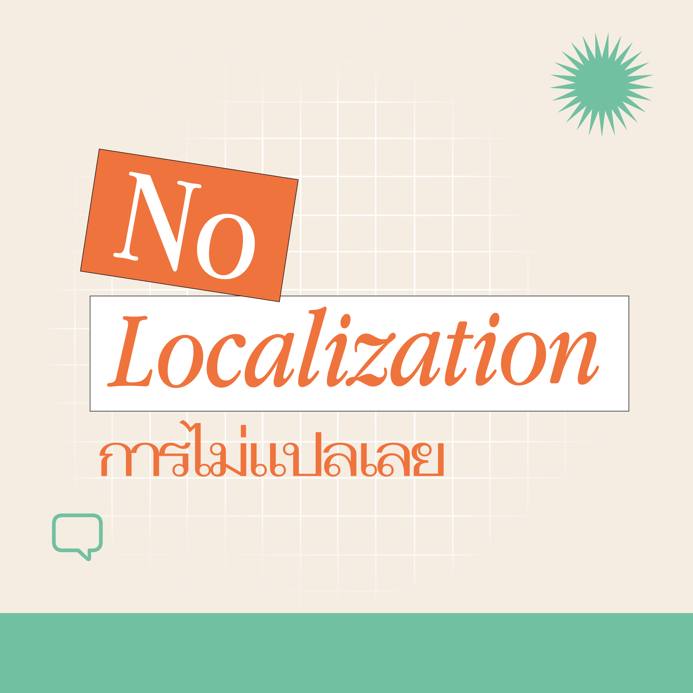
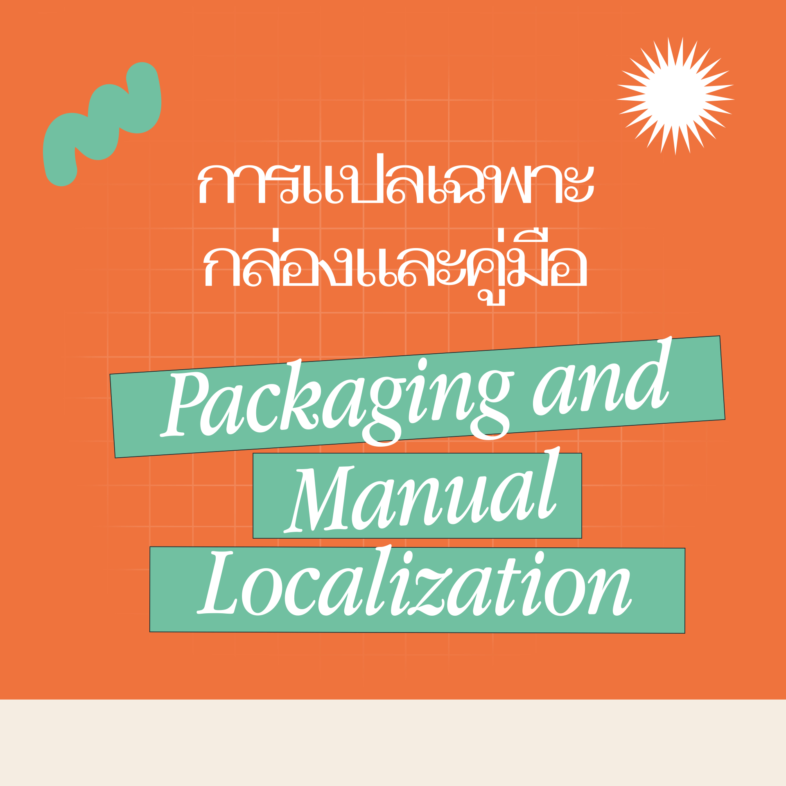
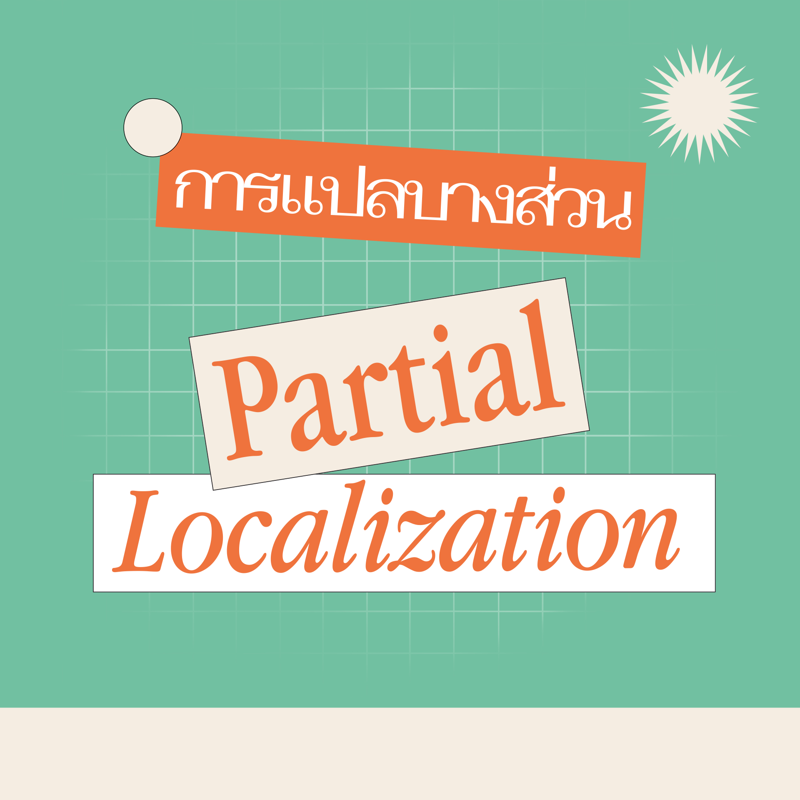

ทุกคนชอบการแปลเกมในระดับไหนคะ

ผู้เล่นหลายคนตัดสินใจไม่ซื้อเมื่อรู้ว่าเกมเล่นได้แค่ภาษาเดียวและไม่ใช่ภาษาที่ตนเข้าใจ ส่งผลให้ยอดขายเกมนั้นลดลง แต่ในทางกลับกัน ผู้เล่นก็จะตัดสินใจซื้อเมื่อรู้ว่าเกมมีการแปลมาให้เล่นในภาษาแม่ของตนได้
การที่บริษัทผู้ผลิตคิดจะลงทุนกับการแปลหรือการ localization หมายความว่าบริษัทจะต้องยอมรับค่าใช้จ่ายไม่น้อยที่จะตามมา รวมถึงความเสี่ยงในแง่ของการเลื่อนวันเปิดขาย ยอดขายไม่ถึงเป้า หรือขาดทุน ดังนั้น เพื่อจะลดความเสี่ยงดังกล่าว ผู้ผลิตและผู้พัฒนาเกมจะคำนึงถึง “ระดับการแปลเกม” ที่จะมีผลต่อการกำหนดขอบเขตวางแผนและขั้นตอนการแปลที่เหมาะสมต่อระดับเกมและความคาดหวังที่มีต่อยอดขายในเกมนั้น ๆ เฮเธอร์ แม็กซ์เวลล์ แชนด์เลอร์ (Heather Maxwell Chandler) ใช้เกณฑ์จัดหมวดหมู่แนวทางการแปลเกมวิดีโอเกมเป็น 4 ระดับ ดังต่อไปนี้ (กดดูรายละเอียดของแต่ละระดับได้นะคะ)

1. การไม่แปลเลย (No Localization) 
2. การแปลเฉพาะกล่องและคู่มือ (Packaging and Manual Localization หรือ “Box and docs”)
3. การแปลบางส่วน (Partial Localization)
4. การแปลทั้งหมด (Full Localization)

แล้วคุณล่ะ อยากให้มีการแปลในระดับไหน

อ้างอิงข้อมูลจาก: Chandler, H. M., & Deming, S. O. M. (2011). The game localization handbook. Jones & Bartlett Publishers.

1. การไม่แปลเลย (No Localization) คือ การที่ผู้ผลิตส่งออกเกมในภาษาและรูปแบบที่เหมือนต้นฉบับไปยังตลาดเกมประเทศอื่น ๆ การแปลระดับนี้มีความเสี่ยงน้อยที่สุด เนื่องจากบริษัทผู้ผลิตเกมไม่ต้องลงทุนในการแปลภาษาหรือปรับเปลี่ยนเนื้อหาในเกมทั้งสิ้น ทว่า มีข้อเสียคือตัวเกมจะไม่ถูกปรับให้เข้ากับแต่ละภูมิภาคหรือประเทศปลายทางอื่น ๆ แม้แต่น้อย

2. การแปลเฉพาะกล่องและคู่มือ (Packaging and Manual Localization หรือ “Box and docs”) คือ การแปลที่ยังคงโค้ดเกมและภาษาเดิมในต้นฉบับไว้ ส่วนเอกสารเพิ่มเติมอื่น ๆ อย่างบรรจุภัณฑ์และคู่มือการเล่นได้รับการแปลเป็นภาษาปลายทาง ระดับการแปลนี้มีความเสี่ยงน้อย เพราะตัวโค้ดเกมไม่มีการเปลี่ยนแปลง ถึงแม้ว่าคู่มือที่แปลมาจะช่วยให้ผู้เล่นเข้าใจวิธีการเล่นได้ดี แต่การเล่นเกมที่ไม่ได้รับการแปลให้เป็นภาษาปลายทางที่เข้าใจได้อาจจะส่งผลให้ผู้เล่นไม่ได้รับประสบการณ์การเล่นอันเต็มอิ่มเท่าที่ควร

3. การแปลบางส่วน (Partial Localization) คือ การแปลเฉพาะตัวบทที่เป็นข้อความในเกม การใส่บทบรรยาย (subtitles) ในบทสนทนาของตัวละคร แต่ไม่รวมถึงการพากย์เสียงใหม่ทับลงไป ซึ่งการแปลเพื่อพากย์เสียงใหม่ลงไปในเกมค่อนข้างยาก โดยเฉพาะเมื่อต้องแปลบทพากย์ให้ตรงกับปากตัวละครที่พูด การแปลระดับนี้มีค่าใช้จ่ายสูงและมีความเสี่ยง เนื่องจากต้องมีการปรับเปลี่ยนโค้ดในเกมเพื่อใส่บทแปล ทว่า ผู้เล่นในภาษาต่างประเทศจะได้รับประสบการณ์ในการเล่นที่มีความเหมาะสมและเพลิดเพลินมากยิ่งขึ้น

4. การแปลทั้งหมด (Full Localization) คือ การแปลทุก ๆ ตัวบทของเกม ทั้งข้อความ เสียงพากย์ คู่มือ และบรรจุภัณฑ์ นับเป็นระดับการแปลที่มีความเสี่ยงและค่าใช้จ่ายสูงที่สุด มักจะใช้เฉพาะกับเกมที่มีงบประมาณมาก อีกทั้ง การแปลระดับนี้มีความยากและละเอียด เนื่องจากผู้พัฒนาต้องทดสอบให้แน่ใจว่าองค์ประกอบทั้งหมดในเกมได้รับการแปลอย่างครบถ้วนและสามารถเล่นได้อย่างไม่มีปัญหา การแปลระดับนี้ส่งผลให้ผู้เล่นในประเทศปลายทางสามารถเล่นเกมได้อย่างสะดวกและได้รับประสบการณ์การเล่นที่ดีที่สุด
