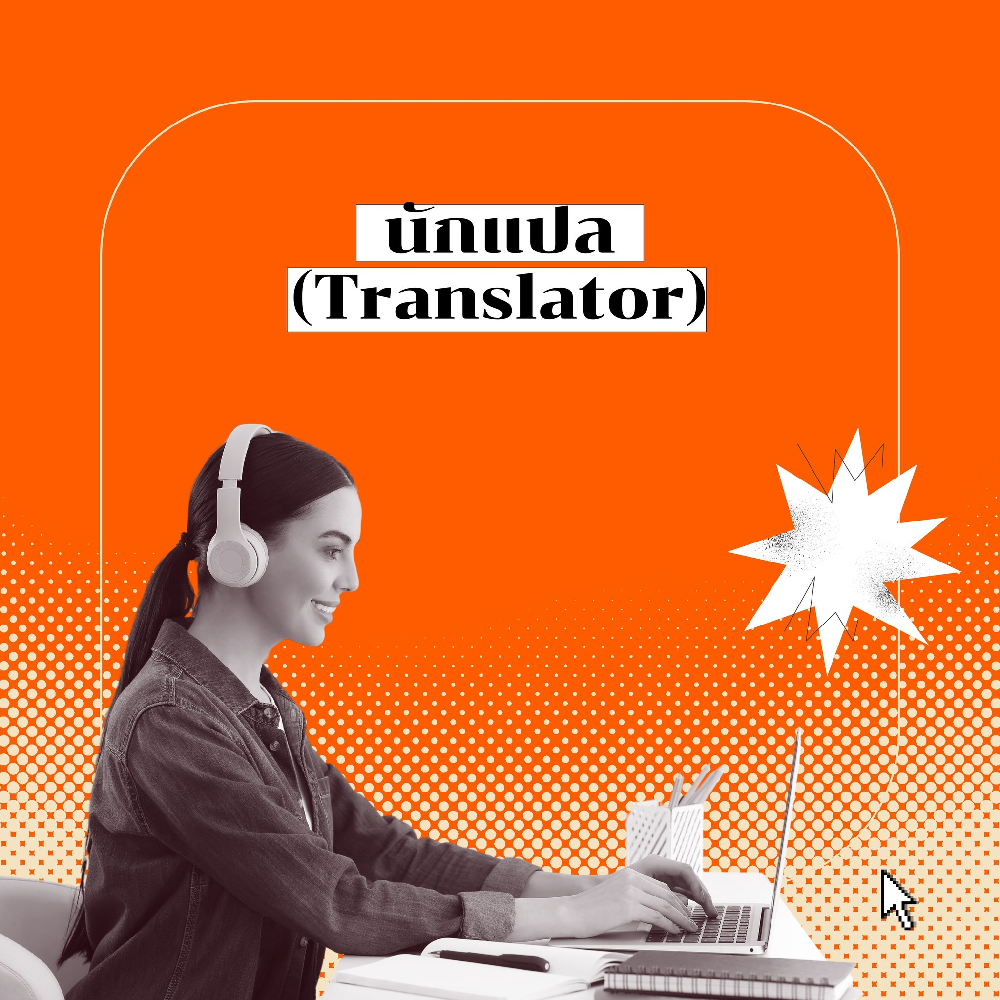
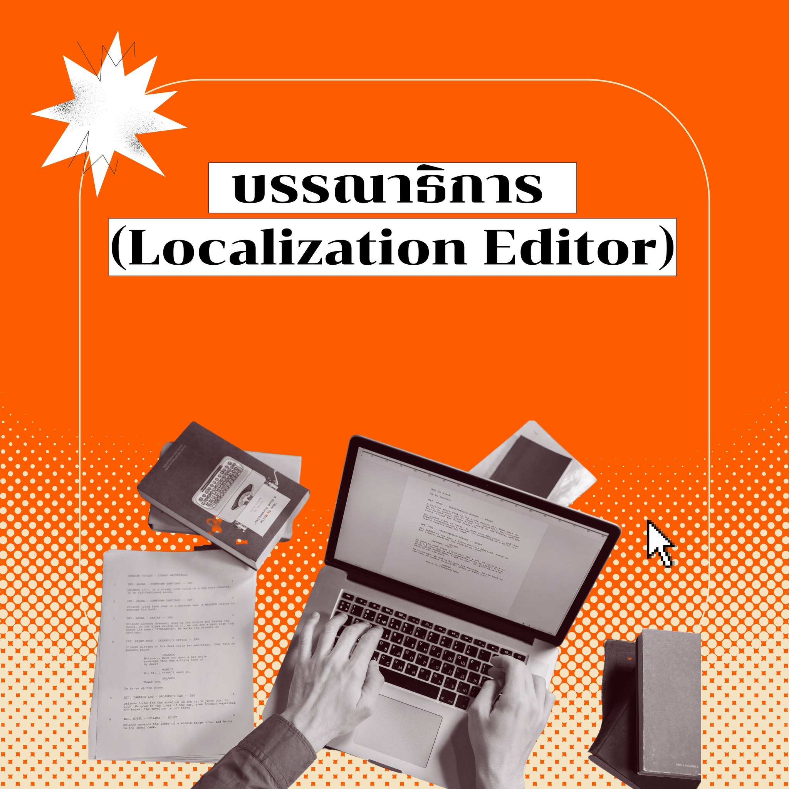
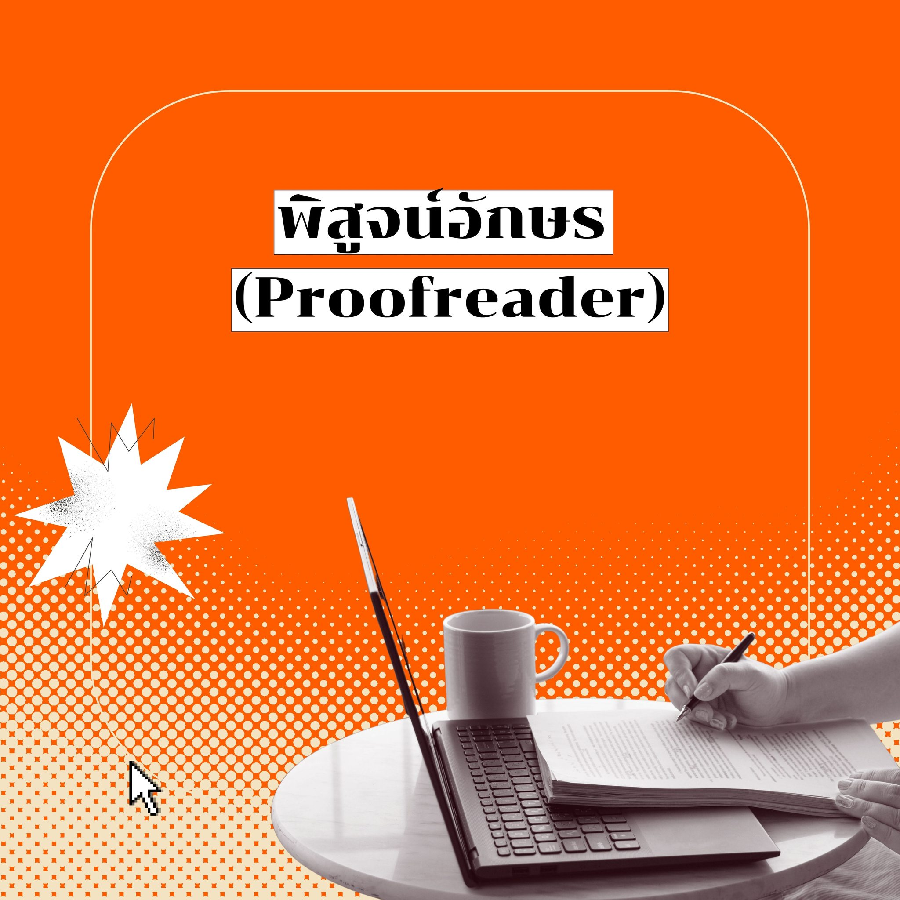
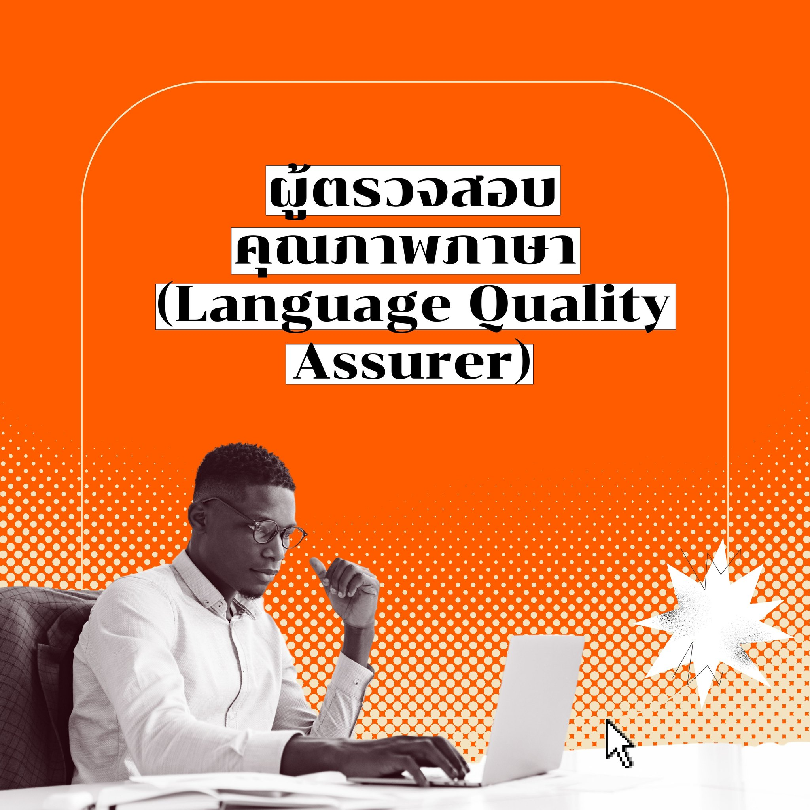
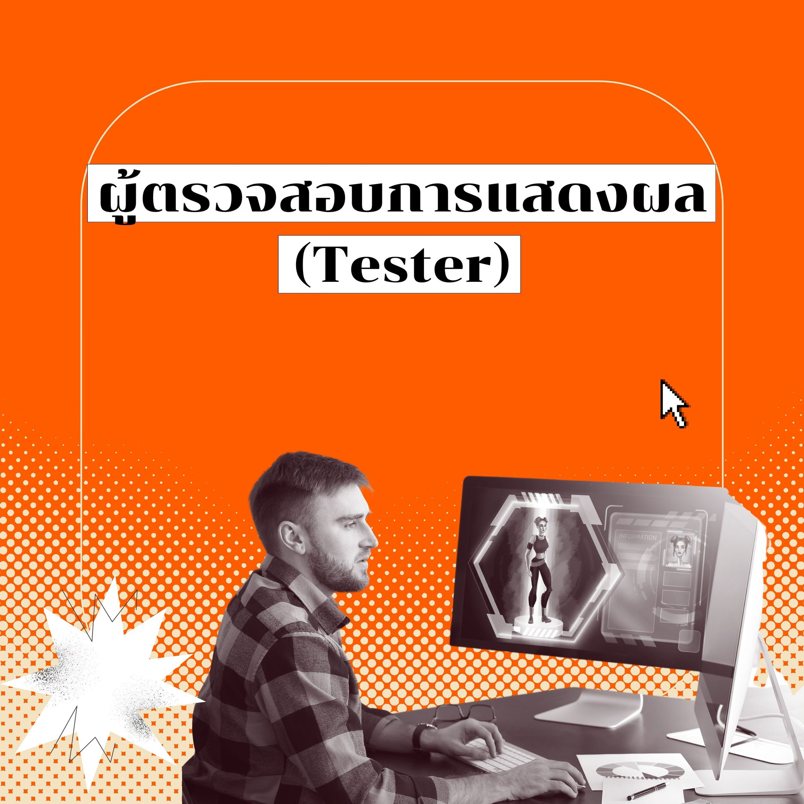
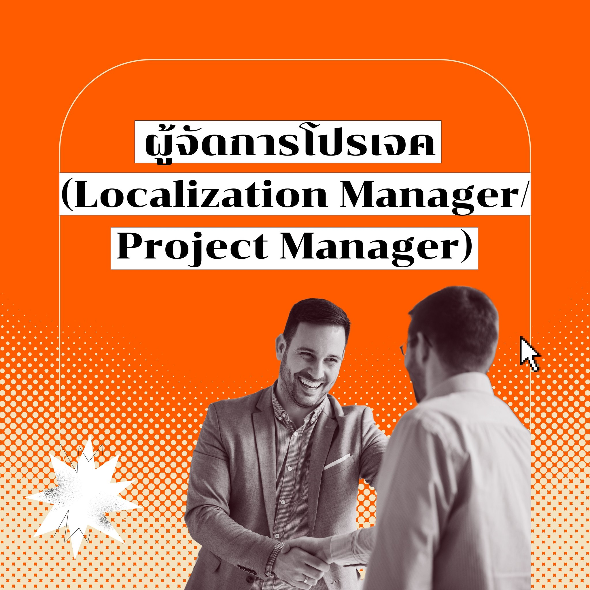

การจะแปลเกม official สักเกม มีแค่นักแปลก็จบจริงเหรอ หรือว่ามีใครเกี่ยวข้องมากกว่านั้น?🎮😳

ในโปรเจคการแปลเกม นักแปลยังต้องทำงานร่วมกับอีกหลายฝ่ายเพื่อให้งานออกมาเป็นตัวเกมเวอร์ชันภาษาต่าง ๆ ได้อย่างสมบูรณ์และให้ผู้เล่นได้เพลิดเพลินกัน ซึ่งในกระบวนการ Localize เกมเป็นภาษาอื่นมีผู้เกี่ยวข้อง ดังนี้ 

นักแปล (Translator) มีหน้าที่หลักคือการแปลตัวบทในเกมจากภาษาต้นทางเป็นภาษาปลายทาง รวมถึงการถอดบทบรรยายและแปลบทบรรยายหรือซับไตเติล เครื่องมือที่นักแปลสามารถใช้ทำงานมีมากมาย ตั้งแต่โปรแกรมช่วยแปล (CAT tools) เช่น โปรแกรม Trados และ MemoQ โปรแกรม QA tools เช่น QA Xbench และโปรแกรมช่วยเช็คการสะกดคำ เช่น MS Word โดยค่าตอบแทนส่วนใหญ่จะคิดเป็นราคาต่อคำ หรือจากจำนวนชั่วโมงในการทำงาน

บรรณาธิการ (Localization Editor) มีหน้าที่หลักคือการตรวจ แก้ไข และให้ความเห็นเกี่ยวกับงานแปลในหลายประเด็น ตั้งแต่การใช้ภาษาที่เหมาะสมจนถึงวัฒนธรรมในสังคมปลายทาง ลักษณะค่าตอบแทนจะคิดเป็นราคาต่อคำ (เรทอยู่ที่ประมาณ 50-75% ของนักแปล) หรือจำนวนชั่วโมงการทำงาน

หัวหน้าคู่ภาษา (Language Lead) มีหน้าที่คอยติดต่อและติดตามฟีดแบกของลูกค้าแทนนักแปล อีกทั้ง เป็นคนกำหนดแนวทางในงานแปลนั้นๆ ว่าจะให้สไตล์ออกมาประมาณไหน ส่งบรีฟให้นักแปลก่อนเพื่อ shape ให้งานที่อาจมีนักแปลหลายคนหรือมีการเปลี่ยนนักแปลระหว่างทาง มีสำนวนที่ไม่แกว่งไปมาจนผิดสังเกต ออกมาในทิศทางเดียวกัน โดยลักษณะค่าตอบแทนจะมากกว่าเรทนักแปลปกติ 3 เท่า

พิสูจน์อักษร (Proofreader) มีหน้าที่ตรวจสอบความถูกต้องของข้อความที่แปลออกมา บางครั้งจะไม่ดูเทียบกับภาษาต้นฉบับแล้วเพราะเป็นหน้าที่ของ Editor แต่ถ้าพบจุดผิดปกติหลุดมาก็อาจจะเอาภาษาต้นฉบับมาเทียบได้ รวมถึงเทียบกับ style guide จากลูกค้าและ/หรือหัวหน้าคู่ภาษา และ/หรือ specific instruction หรือความต้องการเฉพาะเจาะจงของลูกค้า เช่น ชื่อเฉพาะในงานต้องแปล ถอดเสียง หรือค้างไว้เป็นภาษาต้นฉบับ แนวทางในการแปล ความลื่นไหลของภาษาโดยรวม ดูความถูกต้องคร่าวๆ อีกชั้นที่อาจเล็ดลอดสายตานักแปลและบรรณาธิการมาได้เป็นขั้นสุดท้ายก่อนเผยแพร่หรือส่งต่อให้ LQA ประเมินคุณภาพ

Desktop Publisher (DTP) มีหน้าที่หลักในการตรวจสอบรูปแบบการแสดงผลทางภาษาให้ถูกต้อง เช่น ลักษณะฟอนต์และการจัดวางหน้ากระดาษ รวมถึงการแก้ไขปัญหาด้านภาษาถ้าพบข้อผิดพลาด โดยค่าตอบแทนจะคิดเป็นราคาต่อคำ จากจำนวนชั่วโมงการทำงาน หรือจำนวนหน้ากระดาษ (บางครั้งหน้าที่ในส่วนนี้ก็อยู่ในขอบเขตงานของคนที่ทำหน้าที่พิสูจน์อักษร (Proofreader) ด้วยเช่นกัน

ผู้ตรวจสอบคุณภาพภาษา หรือ LQAs (Language Quality Assurer) หน้าที่หลักคือการนำผลงานที่ผ่านมือนักแปล บรรณาธิการ และ/หรือหัวหน้าคู่ภาษา มาตรวจประเมินคุณภาพโดยให้คะแนนตามเกณฑ์ต่างๆ ที่กำหนด จากนั้นจึงบันทึกผลการประเมินว่ามีจุดผิดพลาดตรงไหน แจ้งกลับไปทางหัวหน้าคู่ภาษาและ/หรือ Project Manager เพื่อไปให้ feedback แก่นักแปลและบรรณาธิการอีกทอดนึง เช่น การแจ้งรายละเอียดให้งานหลังจากนี้มีการเน้นส่วนใดเป็นพิเศษ หรืองานก่อนนี้ผิดส่วนใดบ่อย พร้อมส่งผลประเมินให้ลูกค้าพิจารณา ถ้าคะแนนผ่าน หรือมีจุด feedback ไม่มากก็ไปกันต่อ แต่ถ้าคะแนนตกประเมินเยอะ หรือไม่ผ่านติดต่อกันหลายครั้ง จะได้พิจารณาเปลี่ยนทีมแปลได้

ผู้ตรวจสอบการแสดงผล (Tester) มีหน้าที่หลักในการตรวจสอบการแสดงผลของการแปลภาษาในเกมให้มีความถูกต้องและเหมาะสมกับบริบทของเกมในทุก ๆ ระบบ เช่น ระบบปฏิบัติการ iOS และ Andriod ในเกมมือถือ รวมถึงการทดสอบเกมให้เล่นได้ หากเกิดปัญหาต้องรายงานการแก้ไขและติดตามผลหน้าที่ หากมีปัญหาในงานแสดงผลก็ส่งเรื่องกลับไปที่ Proofreader หรือ DTP และถ้าเกิดการแปลผิดก็ส่งเรื่องไปที่ฝ่ายแปลให้แก้ไขต่อไป

ผู้จัดการโปรเจค (Localization Manager/ Project Manager) มีหน้าที่หลักเป็นผู้รับผิดชอบโปรเจค ประสานงานระหว่างลูกค้ากับทีม คัดเลือกนักแปลให้เหมาะกับงานแต่ละชิ้น และจัดการ timeline กระบวนการทำงานตั้งแต่เริ่มต้นการแปลไปจนเสร็จสิ้นอย่างมีคุณภาพและทันเวลา

เห็นได้เลยว่า การทำงานร่วมกันของแต่ละฝ่ายก็เพื่อให้การแปลในเกมออกมามีความถูกต้อง น่าเล่น และเสร็จสิ้นได้ทันเวลาวางขายนั่นเอง!

อ้างอิงข้อมูลจาก
เพจ มือแปลรับจ้าง ขอขอบคุณสำหรับข้อมูลด้วยค่า
LocalLight. (2021). Introduction to Localization [PowerPoint slides]. Classroom lecture.
Nexon Thailand. (2018, September 3). Language Quality Assurance (LQA) - การตรวจสอบคุณภาพภาษา. [Image attached] [Status update]. Facebook. https://www.facebook.com/photo.php?fbid=926885620855134&id=652156534994712&set=a.654457708097928&locale=th_TH
Picken H. (2019, January 15). 7 responsibility of a project manager. The Language Factory. 
https://thelanguagefactory.co.uk/7-key-responsibilities-of-a-translation-project-manager/
